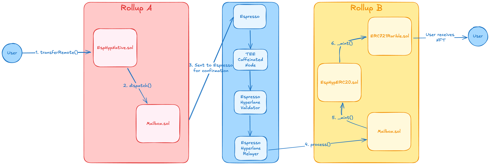

# composables-xchain-mint

The Composables XChain Mint allows users to use funds on one chain to mint NFTs on another chain, without the need to transfer the funds to the destination chain.  This "bridgeless" minting experience removes the need for users to rely on synthetic or wrapped assets, liquidity providers, or canonical bridges. The security of cross-chain mint experience is underpinned by the Espresso network and an AWS Nitro enclave-based RPC. 

This implementation is a proof of concept designed specifically for a cross-chain mint of the Composables NFTs. As such, it makes several simplifying assumptions.  It is not intended as a general purpose cross-chain minting solution at this time, though it may be expanded in the future.  

## High-level Overview

Below is a high-level diagram of the cross-chain minting process. 

[Excalidraw Link](https://excalidraw.com/#json=aKl0gVbDHE-0JMVwpYjsU,cPWKfenoZB7hlBcvVilKcA)

### 1. Initiating the cross-chain mint

Users (or backends/wallets acting on behalf of users) will call the `transferRemote` [function](https://github.com/hyperlane-xyz/hyperlane-monorepo/blob/3869653917cec3ce9886a6d746045d02a6c93bfa/solidity/contracts/token/libs/TokenRouter.sol#L54) on the source chain's `EspHypNative` contract to initiate the cross-chain mint. This function takes the following parameters: 
* `_destination`: The Hyperlane [domain](https://docs.hyperlane.xyz/docs/reference/domains) ID of the destination chain.  This is always known in advance. *Note:* Rari's domain ID differs from its chain ID. 
* `_recipient`: The recipient address on the destination chain. The user supplies this address. 
* `_amountOrId`: The amount of tokens being escrowed on this chain; this should equal the price of the NFT on the destination chain. The NFT price is fixed and known in advance. 

This function handles cross-chain gas payments via Hyperlane's InterchainGasPaymaster.  Users will transfer the following amounts to the `EspHypNative` contract, which inherits from the `TokenRouter` contract. 
* Native ETH funds equal to the price of the NFT on the destination chain
* Gas funds equal to the gas costs of executing the source chain transaction, including any relayer payment fees. 
* Gas funds equal to the estimated costs of executing the destination chain transaction.  

The `quoteDispatch` [function](https://github.com/hyperlane-xyz/hyperlane-monorepo/blob/3869653917cec3ce9886a6d746045d02a6c93bfa/solidity/contracts/Mailbox.sol#L157) on the `Mailbox` contract may be used to estimate the cross-chain costs, if needed.   

Clients may use Hyperlane's [SDK](https://github.com/hyperlane-xyz/hyperlane-monorepo/blob/main/typescript/sdk/README.md) to call the `transferRemote` function on the `EspHypNative` contract.  Additionally, see the `getTransferRemoteTxs` [function](https://github.com/hyperlane-xyz/hyperlane-monorepo/blob/eabd28f0de13ab66f51515f1d3041ecdb7a9c2e2/typescript/sdk/src/warp/WarpCore.ts#L323) for an example.  The SDK contains functions for [gas estimation](https://docs.hyperlane.xyz/docs/reference/developer-tools/typescript-sdk/transfer-fee-calculation) as well. 

Users will not be refunded gas funds on the destination chain if the cross-chain mint costs less gas than estimated.  Users will be able to add additional gas to their transaction if the initial amount is not enough.  However, this situation should be avoided due to the additional complexity put on the user.  It is better to err slightly high on gas costs than low.   

### 2. Minting on the destination chain 

The cross-chain infrastructure handles confirming the source chain on Espresso, relaying the source chain message to the destination chain, and verifying the cross-chain message.  Once these steps are complete the `EspHypERC20` contract will call the `_mint` function on the destination chain's `ERC721Rarible` contract.  The `to` parameter will be filled with the user's supplied recipient address on the destination chain.  The `tokenId` parameter will be filled with the wrapped ETH token represented by the `EspHypERC20` contract. 

The relayer will have a known, fixed address on the destination chain. If the `_mint` function fails for any reason, the user will receive the wrapped ETH token instead.  They can use this token to bridge back to the source chain to claim their funds.  

### Assumptions
* The NFT price is fixed and known in advance. 
* The NFT is listed in the `EspHypERC20` token at the contract level.  This may be displayed as native ETH to the user in a UI, however. 
* All transfer functions on the `EspHypNative` contract will be disabled, save for `transferRemote`.  
* The NFT creator will manually reclaim their funds at a later date by bridging the wrapped ETH token back to the source chain. 
* The frontend and source chain contracts will perform the necessary checks to ensure that the cross-chain mint is valid. A failed `_mint` of the NFT on the destination chain should be an extraordinary edge case. 

## Detailed Architecture
WIP

### Considerations
A list of considerations this document will address once it is completed
* How do users add gas to their cross-chain transaction if they need to?  Is this implemented in the UI?  
* The mint may generate a burst of activity on the destination chain, causing gas prices to increase at a greater-than-normal rate. How will the gas estimation on the source chain handle this, to avoid users underpaying for gas. 
* Espresso will run the relayer at cost; users will pay no relaying fees, only gas fees. 
* Will the UI handle the edge case where users must reclaim their funds on the source chain due to a failed mint?  We could optionally choose to handle this manually and bridge these tokens back to the source chain on behalf of users. 
* Since the NFT is listed in `EspHypERC20` tokens, users with native ETH on Rari will not be able to mint the NFT.  
